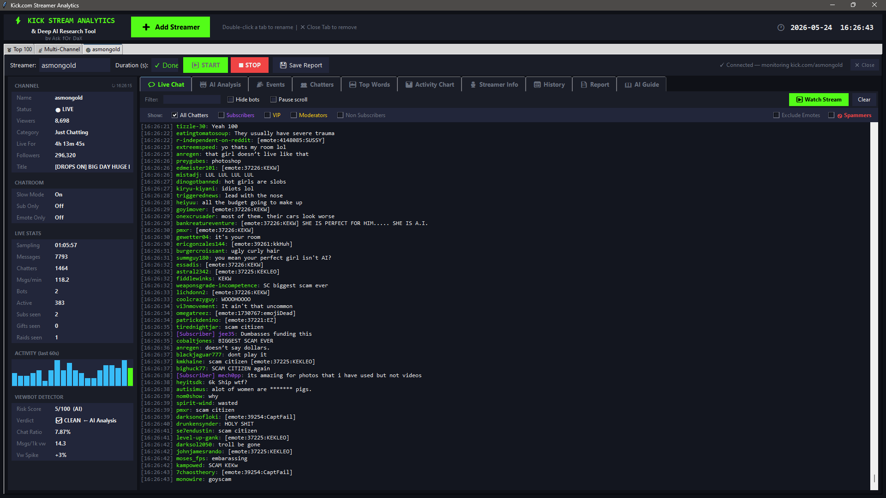
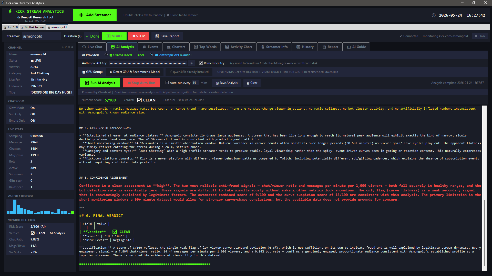
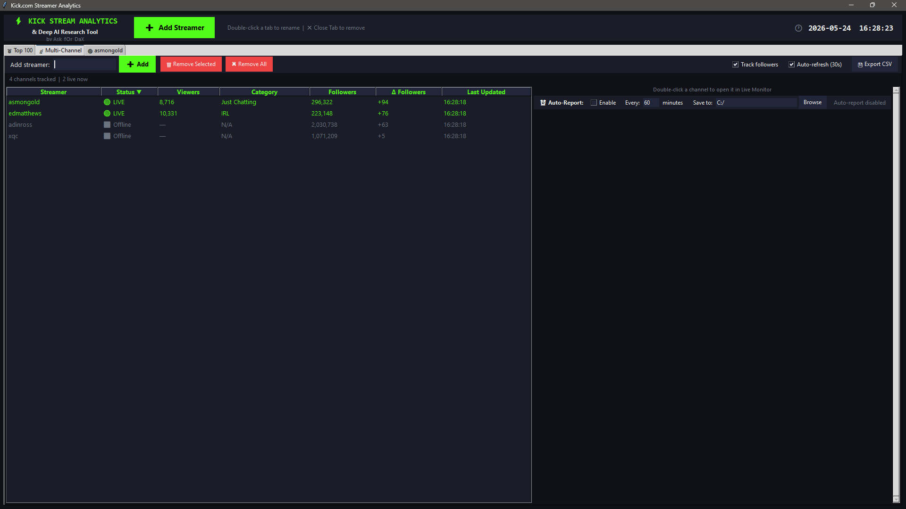

# ⚡ Kick Stream Analytics & Deep AI Research Tool
### by Ask_fOr_DaX

A fully self-contained desktop analytics dashboard for **Kick.com** streamers. Monitor multiple live streams simultaneously, detect viewbots with AI-powered analysis, track chat behaviour, browse the global Top 100, analyse streamer history and generate detailed reports — all from a single GUI with **no Kick account or API key required**.

---

## ✨ Features

- 🔴 **Live chat monitoring** — real-time via Pusher WebSocket, colour-coded badges
- 📺 **Multi-stream support** — monitor multiple streamers in independent tabs
- 🤖 **AI-powered viewbot detection** — Ollama (local/free) or Anthropic Claude API
- 🖥️ **GPU-aware model selection** — auto-detects your GPU and recommends the best LLM
- 📊 **Viewbot detector panel** — live scoring, locks to AI verdict after analysis
- 🔔 **Live notifications** — popup alerts when tracked channels go live
- 🤖 **Auto Monitor** — automatically start monitoring when a tracked channel goes live
- 🏅 **Top 100 global streamers** — live ranking from kickstats.com
- 📡 **Multi-channel monitor** — track dozens of channels simultaneously
- 👥 **Chatter classification** — Active / Casual / Lurker / Known Bot / Likely Bot
- 🚫 **Spam & emote detection** — filter spammers and emote-only messages
- 🔄 **Auto Scan** — Chatters, Top Words and Activity Chart refresh automatically
- 💾 **Chat Logs tab** — record, save and review live chat sessions
- 🔴 **REC indicator** — pulses in session topbar when recording is active
- 🔍 **Chat filters** — filter by username, keyword, @ mentions and replies
- 📅 **Stream history** — VODs, clips, gift leaderboards, stream stats
- 🎙️ **Streamer profiles** — clickable social links, full channel info, top categories
- 📄 **Full session reports** — generate and export detailed analytics
- 📖 **Built-in AI Guide** — embedded reference for all AI features
- 🔄 **Auto-reconnect** — silently reconnects on dropped WebSocket connections

---

## 🖥️ Screenshots

### Main Application — Live Chat & Viewbot Detection

### AI Analysis — Forensic Viewbot Detection Report

### Multi-Channel Monitor — Track Multiple Streamers

---

## 🚀 Two Ways to Run

### Option A — Run from Source (Zero AV flags, recommended)

1. Download or clone this repository
2. Place `kick_report.py` and `install.bat` in the same folder
3. Double-click **`install.bat`** — installs all packages automatically
4. Double-click **`run.bat`** to launch the app

### Option B — Build Your Own EXE Folder

1. Place `kick_report.py`, `build_folder.bat` and `build_spec_folder.py` together
2. Double-click **`build_folder.bat`**
3. Output at `dist\KickAnalytics\` — ZIP and share

> ⚠️ **Never separate `KickAnalytics.exe` from the `_internal\` folder**

---

## ⚙️ System Requirements

| Requirement | Details |
|---|---|
| OS | Windows 10 or Windows 11 (64-bit) |
| Python | 3.9 or higher |
| RAM | 4GB minimum, 8GB recommended |
| Internet | Required for live monitoring |
| Ollama | Optional — local AI analysis only |

---

## 🤖 AI Analysis

The AI Analysis tab sends 10 minutes of collected stream data to an LLM for forensic-level viewbot detection.

| GPU VRAM | Recommended Model | Quality |
|---|---|---|
| 20GB+ | `qwen3:32b` | Outstanding |
| 10–20GB | `qwen3:14b` | Excellent |
| 7–10GB | `qwen3:8b` | Very good ⭐ |
| 5–7GB | `mistral:7b` | Good |
| 3–5GB | `qwen3:4b` | Good |
| 1–3GB | `llama3.2:3b` | Decent |
| CPU only | `phi3:mini` | Decent |

---

## 📋 Tab Overview

### Per-Streamer Tabs

| Tab | Description |
|---|---|
| 💬 Live Chat | Real-time chat, badge filters, @ Mentions, 💬 Replies, ▶ Start/■ Stop/☐ Auto Log |
| 🤖 AI Analysis | AI viewbot detection — Ollama or Claude — 10min lock, auto-run |
| 🎉 Events | 🚀 Raids ⭐ Subs 🎁 Gifts 🔨 Bans ✅ Unbans 📌 Pins 🗑 Deleted 📴 Stream Ended |
| 👥 Chatters | Chatter table, bot classification, Auto Scan 30s, CSV export |
| 🔤 Top Words | Word frequency chart, hide emotes, Auto Scan 20s |
| 📊 Activity | Message volume chart, Auto Scan 20s |
| 🎙️ Streamer Info | Auto-loads on connect, clickable social links, VODs, clips |
| 📅 History | Past streams, clips, gift leaderboards, stream stats |
| 📄 Report | Full session report — generate and export |
| 💾 Chat Logs | Record chat sessions, filter by username/keyword/@mentions/replies |
| 📖 AI Guide | Built-in AI reference guide |

### Global Tabs (pinned left)

| Tab | Description |
|---|---|
| 🏅 Top 100 | Live top 100 Kick streamers — region filter, sortable, CSV |
| 📡 Multi-Channel | Track many channels — Auto Mon, live notifications, LIVE sort |

---

## 🔔 Live Notifications & Auto Monitor

The Multi-Channel tab includes two powerful automation features:

**🔔 Live Notifications/Auto Monitor Enable** — tick to activate

- **Notification popup** — appears in the bottom right corner when a tracked channel goes live
  - Shows channel name, category, viewer count
  - 45 second countdown then auto-closes
  - **Monitor** button opens a new tab and starts monitoring automatically
  - **Dismiss** button closes the notification
  - Multiple notifications stack upward

- **Auto Mon column** — tick individual channels for silent auto-monitoring
  - When that channel goes live a new monitor tab opens and starts automatically
  - No popup shown — completely silent

- **Auto Log column** — tick individual channels to auto-start chat recording
  - Synced two-way with the Auto Log checkbox in the Live Chat tab
  - State saved per streamer across app restarts

> Live Notifications always resets to OFF when the app is closed

---

## 📦 Packages Installed Automatically

| Package | Purpose |
|---|---|
| `websockets` | Real-time Pusher WebSocket connection |
| `curl_cffi` | Kick API requests |
| `keyring` | Secure API key storage |
| `GPUtil` | GPU VRAM detection |
| `psutil` | Process detection |
| `colorama` | Console colour support |
| `tabulate` | Table formatting |
| `typer` | Dependency conflict resolver |

---

## 🔒 Antivirus Notice

Compiled executables may be flagged by antivirus heuristics — this is a **false positive** common to all PyInstaller applications. The full source code is available here for inspection.

**Recommended:** Use **Option A** (source version) — Python scripts are never flagged.

> ❌ Do not submit your compiled exe to VirusTotal

---

## 💾 Chat Logs

Record live chat sessions to organised `.txt` files for later review.

**Controls in Live Chat toolbar:**
- **▶ Start** — begin recording to a timestamped file
- **■ Stop** — stop recording and close the file
- **☐ Auto Log** — auto-starts recording when monitoring begins (saved per streamer)
- **🔴 REC** — pulses in the session topbar whenever recording is active

**File organisation:**
- Set your base save folder in the Chat Logs tab
- App automatically creates a subfolder named after the streamer
- Example: `C:\ChatLogs\xqc\chatlog_xqc_20260527_143022.txt`
- Folder remembered across app restarts

**Filter options in Chat Logs tab:**
- Filter 1/2/3 — filter by username → results in Filtered Chat panel
- Keyword — search message content → results in Filtered Chat panel
- @ Mentions — show messages containing @ → Filtered Chat panel
- 💬 Replies — show Kick reply events → Filtered Chat panel
- All filters use OR logic — any match appears in Filtered Chat

---

## 📄 License

This software is licensed for **personal, non-commercial use only**.

Commercial use by companies or organizations is strictly prohibited without explicit written permission from the author. See [LICENSE](LICENSE) for full terms.

---

## ⚡ Created by [Ask_fOr_DaX](https://github.com/AskForDax)

> This tool is not affiliated with or endorsed by Kick.com
